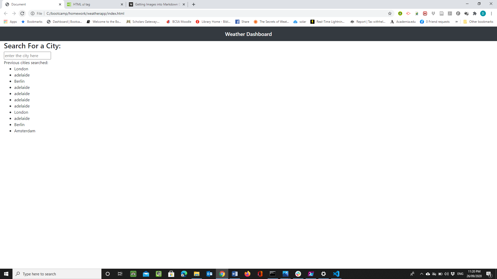
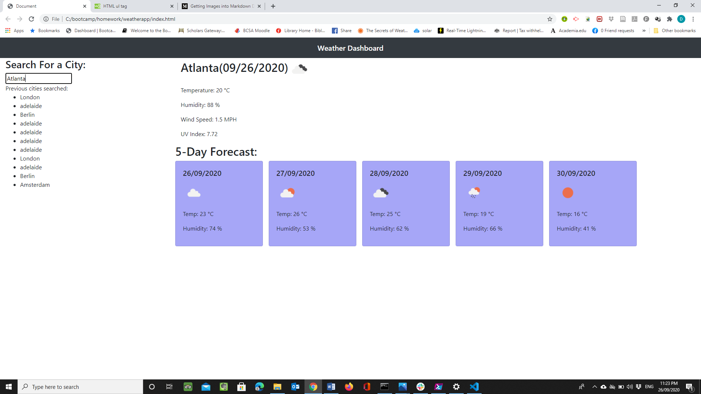

1. On loading the site, the search box and previous cities searched are displayed from local storage
2. on pressing enter, the current weather data is called from  the API using ajax and appened to the div in created elements. 
    An error is caught if the code returned is not 200
3. the UV is searched, returned and appended to the div in a separate API call.
4. The forecast data is returned from an API which returns forecast data for every 3 hours for 5 days. S0 3 pm was picked.
    (There were no free API's which returned maximum and mininimum data)
5. using bootstrap cards, the forecast data was appended to cards created in Jqery in a loop.

